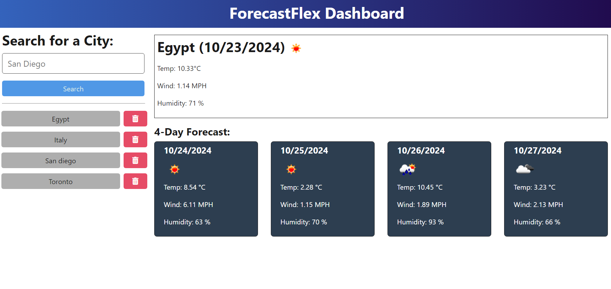
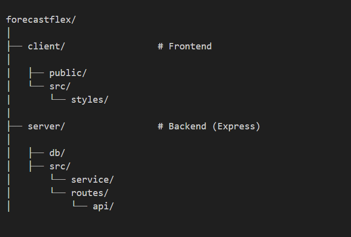

# ForecastFlex

 https://forecastflex.onrender.com 

  
  

## Description

ForecastFlex is a dynamic weather forecasting app that provides real-time, accurate weather updates with flexible and customizable features for users to track the weather condition based on a city and forecast for the next 4 days.

## Table of Contents

- [ForecastFlex](#forecastflex)
  - [Description](#description)
  - [Table of Contents](#table-of-contents)
  - [Installation](#installation)
  - [Usage](#usage)
  - [Tests](#tests)
  - [License](#license)
  - [Directory Structures](#directory-structures)
  - [Contributing](#contributing)

## Installation

N/A

## Usage

The app allows users to search for weather information by entering a city name, which sends a request to the backend API. The backend processes the request and retrieves the weather data from an external API, returning it to the client for display. The app also stores your search history, which can be retrieved with a GET request to /api/weather/history, and individual entries can be deleted using a DELETE request. This setup allows users to view current weather AND forecast next 4 days, track their searches, and manage their search history easily.

## Tests

Application tested with Insomnia.

## License

This project is licensed under the MIT License.

## Directory Structures

## Contributing

Feel free to fork the repository and submit pull requests if you'd like to contribute!

Buy me a coffee? ☕
My contact info: parsamh8@gmail.com